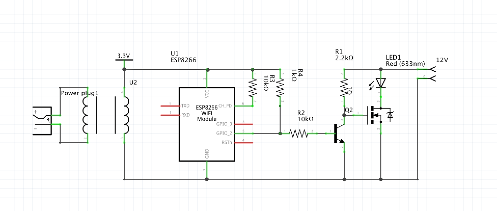

# ESP8266 WIFI LED Lamp

> This is a project to build a WiFi controlled LED lamp using an ESP8266 board.

WiFi controlled LED Lamp designed around the ESP8266 Board with Dimming capability. The Webpage and the lights can be controlled in a miriyad of ways with a common API layer linking them. The Webpage is built using standard HTML, CSS and Javascript (including a full JQuery Library) using AJAX calls to the server using SPIFFS.

## Table of Contents

- [Pre-requisites](#pre-requisites)
- [Build](#build)
- [Install](#install)
- [Usage](#usage)
- [API](#api)
- [Contribute](#contribute)
- [License](#license)

## Pre-requisites

- Programming board for the ESP board (Not required for NodeMCU and other USB enabled boards)
- Driver for serial programmer
- Arduino IDE with ESP8266 board Utils
- SPIFFS plugin for IDE (Downloadable on the internet)

## Build

First we must build the circuitry for the module. This project used the ESP 01 version of the ESP8266 board. A simpler circuit can be re-adopted for other versions of the board such as the NodeMCU's.



Ensure that the ESP module is removeable as this circuit does not have the provision to be programmed

## Install

Install the IDE, boards and Plugins. Select the appropriate board (`Generic ESP8266 Module` for ESP 01) under the `Tools` menu. Ensure that the `Flash Size` under the `Tools` menu is selected for atleast `512K SPIFFS` as this is where the webpage resides.

## Usage

- Connect the board to the programmer and set it to flash mode (holding the flash pin or GPIO 0 to low while resetting the board) (Not required for the NodeMCU board)
- Compile and Upload the Code
- Select `Tools > ESP8266 Sketch Data Upload` to upload the data folder

### Important

The data folder must be a flat folder as the file system of ESP boards does not support folder structures

## API

### Dimming

1. ### GET /dim
    Parameters  
    value={dimming_value} (0 to 1023) : Sets the amount of dimming to apply to the light.

    ```sh
    GET /dim?value=200
    ```

2. ### GET /dimUp
    Increase the dimValue by stepSize (Default 100) and readjust the light.

3. ### GET /dimDown
    Decrease the dimValue by stepSize (Default 100) and readjust the light.

### Sleep Timer

The Sleep timer currently gets deactivated anytime the Dimming or Power On state of the light is changed

1. ### GET /time
    Parameters  
    sec={#} : Set the number of seconds to countdown before lamp switches off  
    min={#} : Set the number of minutes to countdown before lamp switches off  
    hour={#} : Set the number of Hours to countdown before lamp switches off

    The sum of all three parameters in seconds is used to set the sleep timer. All three parameters are optional

    ```sh
    GET /time?sec=10&min=2&hour=0
    ```

### Lamp

1. ### GET /toggle
    Switches the lamp between Power ON and OFF state.

## Contribute

PRs accepted.

## License

[MIT © Ashwin P Chandran.](./LICENSE)